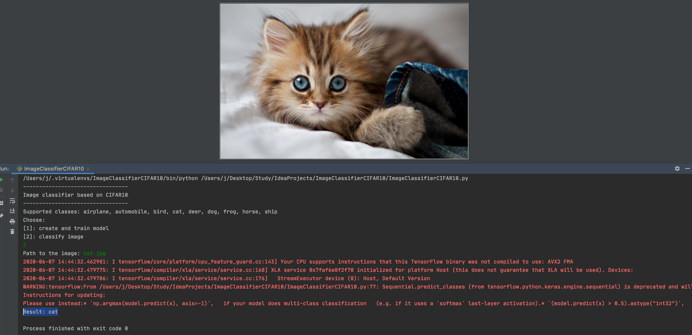

# ОИРС. Домашнее задание №3. Классификация изображений
Нейросеть ршает задачу классификации изображений по следующим категориям: 
* самолеты
* автомобили
* грузовики
* корабли
* птицы
* кошки
* олени
* собаки
* лягушки
* лошади

Для обучения нейронной сети использовался датасет CIFAR-10 — 60 тысяч изображений.
Размер изображений — 32 × 32 пикселя.
Поддержка этого датасета включена в Keras.
Для повышения качества обучения сети из каждого изображения в датасете создаются дополнительные изображения 
со случайными сдвигами, поворотами и отражениями по горизонтали.

**Архитектура**
1. Первые два слоя - это сверточные слои. 

Для первого слоя: 
* количество каналов (фильтров): 32
* размер фильтра: 3x3
* функция активации: relu
* отступы: same - без изменения изображения

Для второго слоя:
* количество каналов (фильтров): 32
* размер фильтра: 3x3
* функция активации: relu
2. Объединение слоев с исключением в 0.25
3. Два сверточных слоя:

Для первого слоя: 
* количество каналов (фильтров): 64
* размер фильтра: 3x3
* функция активации: relu
* отступы: same - без изменения изображения

Для второго слоя:
* количество каналов (фильтров): 64
* размер фильтра: 3x3
* функция активации: relu
4. Объединение слоев с исключением в 0.25
5. Сжатие данных
6. Первый плотно связанный слой: 
* количество нейронов: 512
* функция активации: relu
7. Исключение в 0.5
8. Плотно связанный слой: 
* количество нейронов: 10
* функция активации: softmax
9. Компиляция модели

**Пример работы обученной сети:**

